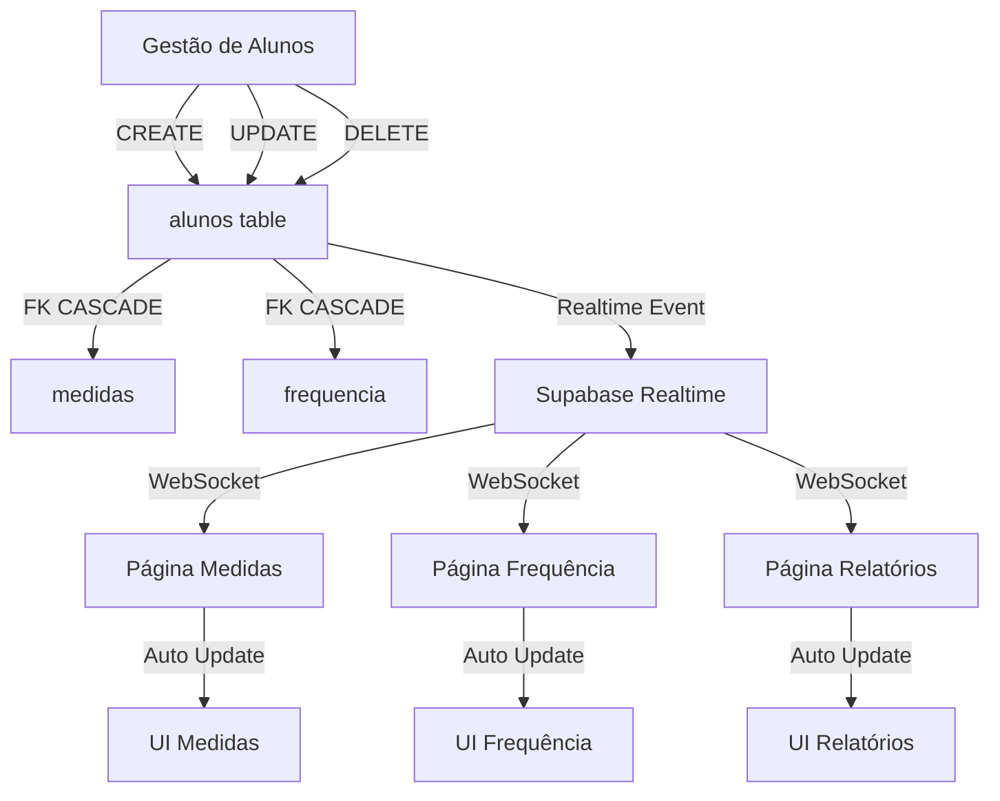

# Sistema de Sincronização com Foreign Keys e Realtime

## 📋 Visão Geral

Implementamos um sistema completo de sincronização entre as tabelas `alunos`, `medidas` e `frequencia` usando:
- **Foreign Keys com CASCADE**: Exclusão automática de registros relacionados
- **Supabase Realtime**: Atualização instantânea entre abas/usuários
- **Chave Canônica**: `alunos.codigo` (BIGINT) como identificador único

## 🔧 Arquitetura Implementada

### 1. Estrutura do Banco de Dados

```sql
alunos (tabela principal)
├── codigo (BIGINT) - PK, chave canônica
├── "Nome completo" (TEXT)
├── turma (TEXT)
└── status (TEXT) - 'ativo' ou 'inativo'

medidas (tabela dependente)
├── id (UUID) - PK
├── codigo_aluno (BIGINT) - FK → alunos.codigo ON DELETE CASCADE
├── codigo_matricula (TEXT) - legado, mantido para compatibilidade
└── [outros campos...]

frequencia (tabela dependente)
├── id (UUID) - PK
├── codigo_aluno (BIGINT) - FK → alunos.codigo ON DELETE CASCADE
├── codigo_matricula (TEXT) - legado, mantido para compatibilidade
└── [outros campos...]
```

### 2. Views Normalizadas

- `v_nota_disciplinar_contadores`: Calcula notas disciplinares com LEFT JOIN
- `v_nota_disciplinar_atual`: Visão atual das notas com classificação
- `v_frequencia_acumulado_aluno_full`: Inclui alunos sem registros (zeros)

## 🚀 Como Usar

### Aplicar Migration no Supabase

1. Acesse o Supabase Dashboard
2. Vá em **SQL Editor** → **New Query**
3. Cole o conteúdo de `migrations/001_normalize_fks.sql`
4. Execute a query

### Integração no Frontend

#### Módulo de Dados (`assets/js/data/alunos.js`)

```javascript
import alunosAPI from './data/alunos.js';

// Criar aluno
const { data, error } = await alunosAPI.createAluno({
    codigo: 2025001,
    nome_completo: 'João Silva',
    turma: '9A',
    status: 'ativo'
});

// Atualizar aluno
await alunosAPI.updateAluno(2025001, {
    turma: '9B'
});

// Excluir aluno (CASCADE remove medidas e frequência)
await alunosAPI.deleteAluno(2025001);

// Verificar relações antes de excluir
const { hasMedidas, hasFrequencia } = await alunosAPI.checkAlunoRelations(2025001);
if (hasMedidas || hasFrequencia) {
    // Avisar usuário sobre exclusão em cascata
}
```

#### Realtime Subscriptions

```javascript
// Inscrever-se para mudanças em alunos
const subscription = alunosAPI.subscribeAlunosChanges((payload) => {
    if (payload.eventType === 'INSERT') {
        console.log('Novo aluno:', payload.new);
    } else if (payload.eventType === 'UPDATE') {
        console.log('Aluno atualizado:', payload.new);
    } else if (payload.eventType === 'DELETE') {
        console.log('Aluno excluído:', payload.old);
    }
});

// Cleanup
subscription.unsubscribe();
```

## 📁 Arquivos Criados/Modificados

### Novos Arquivos
- `migrations/001_normalize_fks.sql` - Migration SQL com FKs e triggers
- `assets/js/data/alunos.js` - Módulo CRUD com realtime
- `assets/js/gestao-alunos-v2.js` - Nova versão da página com realtime
- `assets/js/medidas-realtime.js` - Integração realtime para medidas
- `assets/js/frequencia-realtime.js` - Integração realtime para frequência
- `tests/test-sync-system.html` - Página de testes de sincronização

### Arquivos Atualizados
- `pages/gestao-alunos.html` - Atualizado para usar gestao-alunos-v2.js

## 🧪 Testando o Sistema

### Teste Manual

1. Abra `tests/test-sync-system.html` em duas abas
2. Em uma aba, clique em "Criar Aluno Teste"
3. Na outra aba, observe a atualização automática
4. Teste a exclusão em cascata:
   - Clique em "1️⃣ Criar Aluno + Dados"
   - Clique em "2️⃣ Verificar Relações"
   - Clique em "3️⃣ Excluir e Verificar Cascata"

### Verificar Cascata no Banco

```sql
-- Verificar se FKs estão ativas
SELECT 
    tc.table_name, 
    kcu.column_name, 
    ccu.table_name AS foreign_table,
    ccu.column_name AS foreign_column,
    rc.delete_rule
FROM information_schema.table_constraints tc
JOIN information_schema.key_column_usage kcu 
    ON tc.constraint_name = kcu.constraint_name
JOIN information_schema.constraint_column_usage ccu 
    ON ccu.constraint_name = tc.constraint_name
JOIN information_schema.referential_constraints rc
    ON rc.constraint_name = tc.constraint_name
WHERE tc.constraint_type = 'FOREIGN KEY'
    AND tc.table_name IN ('medidas', 'frequencia');
```

## 🔄 Fluxo de Dados



## ⚠️ Pontos de Atenção

### Compatibilidade Mantida
- Campo `codigo_matricula` (TEXT) mantido para compatibilidade
- Triggers convertem automaticamente entre `codigo_matricula` e `codigo_aluno`
- Views normalizam ambos os campos

### Performance
- Índices criados em `codigo_aluno` para queries rápidas
- Views otimizadas com LEFT JOIN para incluir alunos sem registros
- Realtime usa canais específicos para reduzir overhead

### Segurança
- FKs garantem integridade referencial
- CASCADE previne registros órfãos
- Validação de dados antes de operações críticas

## 🚨 Troubleshooting

### Erro: Foreign key violation
**Causa**: Existem registros órfãos em medidas/frequencia
**Solução**: Execute limpeza antes de aplicar FKs
```sql
DELETE FROM medidas WHERE codigo_aluno NOT IN (SELECT codigo FROM alunos);
DELETE FROM frequencia WHERE codigo_aluno NOT IN (SELECT codigo FROM alunos);
```

### Realtime não atualiza
**Causa**: Subscription não ativa ou erro de permissão
**Solução**: 
1. Verifique console do browser para erros
2. Confirme que Realtime está habilitado no Supabase
3. Verifique políticas RLS nas tabelas

### Cascata não funciona
**Causa**: FKs não aplicadas corretamente
**Solução**: Re-execute a migration e verifique constraints

## 📊 Benefícios do Sistema

1. **Consistência de Dados**: FKs garantem que não existam registros órfãos
2. **Atualização em Tempo Real**: Mudanças refletem instantaneamente
3. **Simplificação do Código**: Não precisa gerenciar exclusões manuais
4. **Melhor UX**: Usuários veem dados sempre atualizados
5. **Manutenção Reduzida**: Sistema auto-gerenciado via banco

## 🔮 Próximos Passos

1. [ ] Implementar soft delete (exclusão lógica) para auditoria
2. [ ] Adicionar logs de mudanças para rastreabilidade
3. [ ] Criar dashboard de monitoramento de sincronização
4. [ ] Implementar cache local para operações offline
5. [ ] Adicionar notificações push para mudanças importantes

## 📝 Notas de Versão

- **v1.0.0** (2025-01-04): Implementação inicial com FKs CASCADE e Realtime
  - Migration SQL com normalização de chaves
  - Módulo data/alunos.js com CRUD completo
  - Integração realtime em todas as páginas
  - Sistema de testes completo