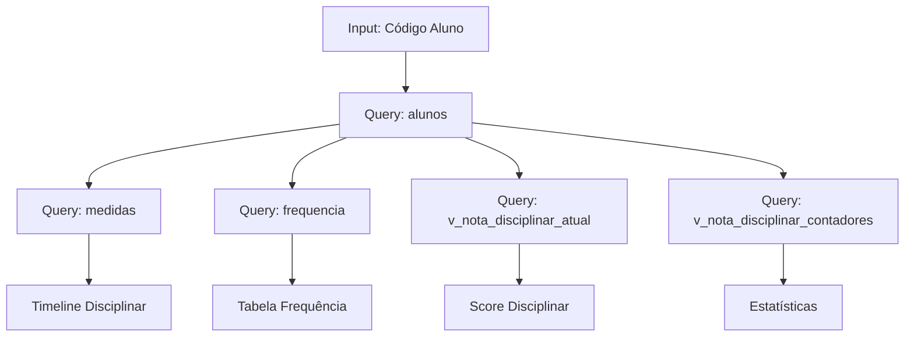

# 📊 RELATÓRIO TÉCNICO - Portal dos Pais (consulta-aluno.html)

## 📋 Sumário Executivo

### Status Atual: ⚠️ **CRÍTICO - Sem Autenticação e RLS**

A página `consulta-aluno.html` permite consulta de dados disciplinares e frequência de alunos, mas apresenta **falhas críticas de segurança**:

1. ❌ **Sem autenticação** - Qualquer pessoa pode acessar dados de qualquer aluno
2. ❌ **Sem RLS (Row Level Security)** - Não há isolamento entre dados de diferentes famílias
3. ❌ **Vazamento de dados** - Código do aluno exposto permite acesso não autorizado
4. ⚠️ **Performance subótima** - Múltiplas queries sem otimização
5. ⚠️ **Logs excessivos** - Console com informações sensíveis em produção

---

## 🗄️ Estrutura do Banco de Dados

### Tabelas Principais
```sql
┌──────────────┐      ┌──────────────┐      ┌──────────────┐
│   alunos     │      │   medidas    │      │  frequencia  │
├──────────────┤      ├──────────────┤      ├──────────────┤
│ codigo (PK)  │◄─────│ codigo_aluno │      │ codigo_aluno │─────►
│ Nome completo│      │ tipo_medida  │      │ data         │
│ turma        │      │ data         │      │ status       │
│ turno        │      │ especificacao│      │ turma        │
└──────────────┘      └──────────────┘      └──────────────┘
```

### Views Utilizadas

1. **v_nota_disciplinar_atual** - Nota disciplinar calculada
2. **v_nota_disciplinar_contadores** - Contadores de medidas por tipo
3. **v_frequencia_acumulado_aluno** - Resumo de frequência
4. **mv_frequencia_mensal_aluno** - Frequência mensal (materializada)

### ⚠️ Tabelas/Campos Ausentes

- ❌ **Tabela `responsaveis`** - Não existe
- ❌ **Tabela `aluno_responsavel`** - Relação não mapeada
- ❌ **Campo `email_responsavel`** em `alunos`
- ❌ **Campo `telefone_responsavel`** em `alunos`
- ❌ **Campo `cpf_responsavel`** para autenticação

---

## 🔐 Análise de Segurança

### Vulnerabilidades Críticas

#### 1. Ausência Total de Autenticação
```javascript
// ATUAL - SEM PROTEÇÃO
async function buscarAluno() {
    const codigoAluno = document.getElementById('codigoAluno').value;
    // QUALQUER PESSOA PODE CONSULTAR QUALQUER ALUNO!
    const { data: aluno } = await supabase
        .from('alunos')
        .select('*')
        .eq('codigo', codigoAluno)
        .single();
}
```

#### 2. Sem RLS no Supabase
```sql
-- NENHUMA POLICY EXISTE PARA ISOLAR DADOS
-- Todos podem ver todos os dados se souberem o código
```

#### 3. Exposição de Dados Sensíveis
- Código do aluno visível na URL/console
- Logs com dados pessoais
- Sem criptografia de dados sensíveis

### Recomendações de Segurança

#### 1. Implementar Autenticação de Responsáveis
```sql
-- Nova tabela de responsáveis
CREATE TABLE public.responsaveis (
    id UUID DEFAULT gen_random_uuid() PRIMARY KEY,
    cpf VARCHAR(11) UNIQUE NOT NULL,
    nome VARCHAR(255) NOT NULL,
    email VARCHAR(255) UNIQUE NOT NULL,
    telefone VARCHAR(20),
    senha_hash TEXT NOT NULL,
    created_at TIMESTAMP DEFAULT NOW(),
    updated_at TIMESTAMP DEFAULT NOW()
);

-- Relação responsável-aluno
CREATE TABLE public.responsavel_aluno (
    responsavel_id UUID REFERENCES responsaveis(id) ON DELETE CASCADE,
    aluno_codigo BIGINT REFERENCES alunos(codigo) ON DELETE CASCADE,
    parentesco VARCHAR(50) NOT NULL, -- pai, mãe, avô, etc
    autorizado_retirar BOOLEAN DEFAULT true,
    PRIMARY KEY (responsavel_id, aluno_codigo)
);
```

#### 2. Implementar RLS Policies
```sql
-- Policy para responsáveis verem apenas seus dependentes
ALTER TABLE alunos ENABLE ROW LEVEL SECURITY;

CREATE POLICY "Responsaveis veem seus dependentes" ON alunos
    FOR SELECT
    USING (
        codigo IN (
            SELECT aluno_codigo 
            FROM responsavel_aluno 
            WHERE responsavel_id = auth.uid()
        )
    );

-- Policy para medidas
ALTER TABLE medidas ENABLE ROW LEVEL SECURITY;

CREATE POLICY "Responsaveis veem medidas de seus dependentes" ON medidas
    FOR SELECT
    USING (
        codigo_aluno IN (
            SELECT aluno_codigo 
            FROM responsavel_aluno 
            WHERE responsavel_id = auth.uid()
        )
    );

-- Policy para frequência
ALTER TABLE frequencia ENABLE ROW LEVEL SECURITY;

CREATE POLICY "Responsaveis veem frequencia de seus dependentes" ON frequencia
    FOR SELECT
    USING (
        codigo_aluno IN (
            SELECT aluno_codigo 
            FROM responsavel_aluno 
            WHERE responsavel_id = auth.uid()
        )
    );
```

---

## 🗺️ Mapeamento Dados → UI

### Fluxo de Dados Atual



### Campos Mapeados

| UI Element | Data Source | Campo |
|------------|-------------|-------|
| Nome do Aluno | alunos | Nome completo |
| Código | alunos | codigo |
| Turma | alunos | turma |
| Avatar | Calculado | Iniciais do nome |
| Nota Disciplinar | v_nota_disciplinar_atual | nota_atual |
| Timeline | medidas | tipo_medida, data, especificacao |
| % Frequência | v_frequencia_acumulado_aluno | pct_presenca_operacional |
| Faltas | frequencia | WHERE status = 'F' |
| Gráficos | Agregado no frontend | - |

---

## ⚡ Análise de Performance

### Problemas Identificados

1. **N+1 Queries** - Múltiplas consultas sequenciais
2. **Sem índices otimizados** para busca por código
3. **Agregações no frontend** ao invés do banco
4. **Sem cache** de dados estáticos
5. **Logs síncronos** bloqueando renderização

### Índices Necessários

```sql
-- Índices críticos ausentes
CREATE INDEX idx_medidas_codigo_aluno_data ON medidas(codigo_aluno, data DESC);
CREATE INDEX idx_frequencia_codigo_aluno_data ON frequencia(codigo_aluno, data DESC);
CREATE INDEX idx_alunos_nome_completo ON alunos("Nome completo" text_pattern_ops);
CREATE INDEX idx_responsavel_aluno_lookup ON responsavel_aluno(responsavel_id, aluno_codigo);
```

### Query Otimizada

```sql
-- View consolidada para Portal dos Pais
CREATE OR REPLACE VIEW v_portal_pais AS
WITH medidas_agg AS (
    SELECT 
        codigo_aluno,
        COUNT(*) as total_medidas,
        MAX(data) as ultima_medida,
        jsonb_agg(
            jsonb_build_object(
                'data', data,
                'tipo', tipo_medida,
                'descricao', especificacao
            ) ORDER BY data DESC
        ) FILTER (WHERE data > CURRENT_DATE - INTERVAL '30 days') as medidas_recentes
    FROM medidas
    GROUP BY codigo_aluno
),
freq_agg AS (
    SELECT 
        codigo_aluno,
        COUNT(*) FILTER (WHERE status = 'P') as presencas,
        COUNT(*) FILTER (WHERE status = 'F') as faltas,
        COUNT(*) FILTER (WHERE status = 'A') as atestados,
        ROUND(100.0 * COUNT(*) FILTER (WHERE status IN ('P', 'A')) / NULLIF(COUNT(*), 0), 2) as percentual_freq
    FROM frequencia
    WHERE data >= DATE_TRUNC('month', CURRENT_DATE)
    GROUP BY codigo_aluno
)
SELECT 
    a.*,
    COALESCE(m.total_medidas, 0) as total_medidas,
    m.ultima_medida,
    m.medidas_recentes,
    COALESCE(f.presencas, 0) as presencas_mes,
    COALESCE(f.faltas, 0) as faltas_mes,
    COALESCE(f.percentual_freq, 100) as percentual_frequencia,
    n.nota_atual as nota_disciplinar
FROM alunos a
LEFT JOIN medidas_agg m ON m.codigo_aluno = a.codigo
LEFT JOIN freq_agg f ON f.codigo_aluno = a.codigo
LEFT JOIN v_nota_disciplinar_atual n ON n.codigo_aluno = a.codigo;
```

---

## 🔧 Implementação Proposta

### 1. Sistema de Autenticação para Pais

```javascript
// auth-responsavel.js
class AuthResponsavel {
    constructor(supabase) {
        this.supabase = supabase;
    }

    async login(cpf, senha) {
        // Autenticar via Supabase Auth ou custom JWT
        const { data, error } = await this.supabase.auth.signInWithPassword({
            email: `${cpf}@parent.local`, // Email fictício baseado em CPF
            password: senha
        });
        
        if (error) throw error;
        
        // Buscar dados do responsável
        const { data: responsavel } = await this.supabase
            .from('responsaveis')
            .select('*, responsavel_aluno(aluno_codigo)')
            .eq('id', data.user.id)
            .single();
            
        return { user: data.user, responsavel };
    }

    async getAlunos() {
        // RLS garante que só retorna alunos autorizados
        const { data, error } = await this.supabase
            .from('alunos')
            .select('*');
            
        return data;
    }
}
```

### 2. Página de Login para Responsáveis

```html
<!-- login-responsavel.html -->
<!DOCTYPE html>
<html lang="pt-BR">
<head>
    <title>Portal dos Pais - Login</title>
    <link rel="stylesheet" href="../assets/css/login-responsavel.css">
</head>
<body>
    <div class="login-container">
        <h1>Portal dos Pais</h1>
        <form id="loginForm">
            <input type="text" id="cpf" placeholder="CPF" required maxlength="11">
            <input type="password" id="senha" placeholder="Senha" required>
            <button type="submit">Entrar</button>
        </form>
        <a href="#" onclick="esqueceuSenha()">Esqueceu sua senha?</a>
    </div>
    <script src="../assets/js/auth-responsavel.js"></script>
</body>
</html>
```

### 3. Consulta Otimizada

```javascript
// consulta-aluno-v2.js
class ConsultaAlunoSegura {
    constructor(supabase) {
        this.supabase = supabase;
        this.cache = new Map();
    }

    async carregarDadosAluno(codigoAluno) {
        // Verificar cache
        if (this.cache.has(codigoAluno)) {
            const cached = this.cache.get(codigoAluno);
            if (Date.now() - cached.timestamp < 300000) { // 5 minutos
                return cached.data;
            }
        }

        // Query otimizada única
        const { data, error } = await this.supabase
            .from('v_portal_pais')
            .select('*')
            .eq('codigo', codigoAluno)
            .single();

        if (error) throw error;

        // Cachear resultado
        this.cache.set(codigoAluno, {
            data,
            timestamp: Date.now()
        });

        return data;
    }
}
```

---

## 🧪 Plano de Testes

### Cenários de Teste

#### 1. Autenticação
- [ ] Login com CPF/senha válidos
- [ ] Login com credenciais inválidas
- [ ] Recuperação de senha
- [ ] Timeout de sessão
- [ ] Logout seguro

#### 2. Autorização (RLS)
- [ ] Responsável vê apenas seus dependentes
- [ ] Responsável com múltiplos filhos
- [ ] Tentativa de acesso a aluno não autorizado
- [ ] SQL injection attempts
- [ ] Cross-site scripting (XSS) prevention

#### 3. Funcionalidade
- [ ] Visualização de dados do aluno
- [ ] Filtros de período
- [ ] Exportação de relatórios
- [ ] Navegação entre abas
- [ ] Responsividade mobile

#### 4. Performance
- [ ] Tempo de carregamento < 2s
- [ ] Cache funcionando
- [ ] Paginação de listas longas
- [ ] Otimização de imagens/avatars

### Script de Teste Automatizado

```javascript
// tests/portal-pais.test.js
describe('Portal dos Pais', () => {
    test('Responsável só vê seus dependentes', async () => {
        const auth = new AuthResponsavel(supabase);
        await auth.login('12345678900', 'senha123');
        
        const alunos = await auth.getAlunos();
        
        expect(alunos).toHaveLength(2); // Pai com 2 filhos
        expect(alunos[0].codigo).toBe(123);
        expect(alunos[1].codigo).toBe(456);
    });

    test('Acesso negado a aluno não autorizado', async () => {
        const auth = new AuthResponsavel(supabase);
        await auth.login('12345678900', 'senha123');
        
        const consulta = new ConsultaAlunoSegura(supabase);
        
        await expect(
            consulta.carregarDadosAluno(999) // Aluno de outra família
        ).rejects.toThrow('Permission denied');
    });
});
```

---

## 📋 Checklist de Implementação

### Fase 1: Segurança Crítica
- [ ] Criar tabelas `responsaveis` e `responsavel_aluno`
- [ ] Implementar RLS policies
- [ ] Criar sistema de autenticação
- [ ] Adicionar página de login
- [ ] Remover acesso direto por código

### Fase 2: Otimização
- [ ] Criar view consolidada `v_portal_pais`
- [ ] Adicionar índices necessários
- [ ] Implementar cache no frontend
- [ ] Reduzir logs em produção
- [ ] Otimizar queries

### Fase 3: UX/Features
- [ ] Melhorar responsividade mobile
- [ ] Adicionar exportação PDF
- [ ] Implementar notificações push
- [ ] Dashboard personalizado
- [ ] Histórico completo com paginação

### Fase 4: Monitoramento
- [ ] Logs de auditoria
- [ ] Métricas de performance
- [ ] Alertas de segurança
- [ ] Backup automático
- [ ] Rate limiting

---

## 🚨 Ações Imediatas Requeridas

1. **DESATIVAR PÁGINA ATUAL** - Risco de vazamento de dados
2. **Implementar autenticação** antes de reativar
3. **Ativar RLS** em todas as tabelas
4. **Remover logs** com dados sensíveis
5. **Adicionar HTTPS** obrigatório
6. **Implementar rate limiting** para prevenir scraping

---

## 📊 Métricas de Sucesso

- 🔒 **0 vazamentos** de dados entre famílias
- ⚡ **< 2s** tempo de carregamento
- 📱 **100% mobile-friendly**
- 🔐 **100% das queries** com RLS
- 📈 **> 90% satisfação** dos pais

---

## 🔗 Referências

- [Supabase RLS Documentation](https://supabase.com/docs/guides/auth/row-level-security)
- [OWASP Security Guidelines](https://owasp.org/www-project-top-ten/)
- [Web Performance Best Practices](https://web.dev/performance/)
- [LGPD Compliance](https://www.gov.br/cidadania/pt-br/acesso-a-informacao/lgpd)

---

**Data do Relatório**: 2024-01-04  
**Autor**: Sistema de Análise Automatizada  
**Criticidade**: 🔴 **ALTA - Requer ação imediata**